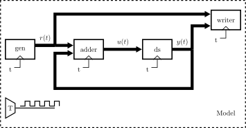
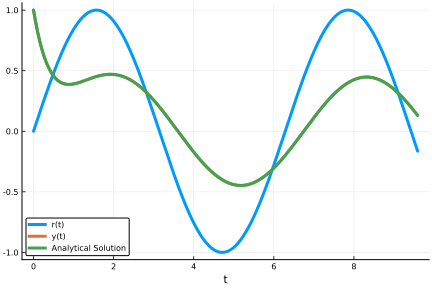

# Causal
[](https://zekeriyasari.github.io/Causal.jl/stable)
[](https://zekeriyasari.github.io/Causal.jl/dev)
[](https://github.com/zekeriyasari/Causal.jl/actions/workflows/ci.yml)
[](https://codecov.io/gh/zekeriyasari/Causal.jl)
[](https://coveralls.io/github/zekeriyasari/Causal.jl)
[](https://juliahub.com/ui/Packages/Causal/aS0XM)

**NOTE:** This package was formerly called as Jusdl.jl. v0.2.1 is the last version of Jusdl. No further updates will be available for Jusdl. For further updates, please add Causal.jl.

Causal.jl focusses on effective systems simulations together with online and offline data analysis. In Causal, it is possible to simulate discrete time and continuous time, static or dynamical systems. In particular, it is possible to simulate dynamical systems modeled by different types of differential equations such as ODE (Ordinary Differential Equation), Random Ordinary Differential Equation (RODE), SDE (Stochastic Differential Equation), DDE (Delay Differential Equation) and DAE (Differential Algebraic Equation), and discrete difference equations. During the simulation, the data flowing through the links of the model can processed online and specialized analyzes can be performed. These analyzes can also be enriched with plugins that can easily be defined using the standard Julia library or various Julia packages. The simulation is performed by evolving the components of the model individually and in parallel in sampling time intervals. The individual evolution of the components allows the simulation of the models including the components that are represented by different kinds of mathematical equations.

## Features

* Simulation of a large class of systems: 
    * Static systems (whose input, output relation is represented by a functional relation)
    * Dynamical systems (whose input, state and output relation is represented by difference or differential equations[1]).
        * Dynamical systems modelled by continuous time differential equations: ODE, DAE, RODE, SDE, DDE.
        * Dynamics systems modelled by discrete time difference equations.
* Simulation of models consisting of components that are represented by different type mathematical equations.
* Individual construction of components, no need to construct a unique equation representing the whole model.
* Online data analysis through plugins 
* Flexibility to enrich the data analysis scope through user-defined plugins.

[1] : [DifferentialEquations.jl](https://docs.juliadiffeq.org/) package is used for differential equation solving.

## Installation
Enter the Pkg REPL by pressing ] from the Julia REPL and then add Causal:
```julia
] add Causal
```

## A First Look

Consider following simple model.

<center>
    
</center>

Note that the model consists of connected components. In this example, the components are the sinusoidal wave generator, an adder, a dynamical system. The writer is included in the model to save simulation data. By using Causal, the model is simulated as follows:

```julia
using Causal 

# Describe model 
@defmodel model begin
    @nodes begin 
        gen = SinewaveGenerator(amplitude=1., frequency=1/2π) 
        adder = Adder(signs=(+, -)) 
        ds = ContinuousLinearSystem(state=[1.])
        writer = Writer(input=Inport(2)) 
    end 
    @branches begin 
        gen[1] => adder[1] 
        adder[1] => ds[1]
        ds[1] => adder[2] 
        ds[1] => writer[1]
        gen[1] => writer[2]
    end
end

# Simulate the model 
tinit, tsample, tfinal = 0., 0.01, 10. 
sim = simulate!(model, tinit, tsample, tfinal)

# Read and plot data 
t, x = read(getnode(model, :writer).component)
using Plots
plot(t, x[:, 1], label="r(t)", xlabel="t")
plot!(t, x[:, 2], label="y(t)", xlabel="t")
plot!(t, 6 / 5 * exp.(-2t) + 1 / 5 * (2 * sin.(t) - cos.(t)), label="Analytical Solution")
```

```
[ Info: 2020-05-04T23:32:00.338 Started simulation...
[ Info: 2020-05-04T23:32:00.338 Inspecting model...
┌ Info:         The model has algrebraic loops:[[2, 3]]
└               Trying to break these loops...
[ Info:         Loop [2, 3] is broken
[ Info: 2020-05-04T23:32:00.479 Done.
[ Info: 2020-05-04T23:32:00.479 Initializing the model...
[ Info: 2020-05-04T23:32:01.283 Done...
[ Info: 2020-05-04T23:32:01.283 Running the simulation...
Progress: 100%|████████████████████████████████████████████████████████████████████████████████████████████████████████████████| Time: 0:00:00
[ Info: 2020-05-04T23:32:01.469 Done...
[ Info: 2020-05-04T23:32:01.469 Terminating the simulation...
[ Info: 2020-05-04T23:32:01.476 Done.
```
<center>
    
</center>

For more information about how to use Causal, see its [documentation](https://zekeriyasari.github.io/Causal.jl/dev/) .

## JuliaCon2020 Talk

[](https://www.youtube.com/watch?v=VTn8j-HDzIQ "Everything Is AWESOME")

## Contribution 
Any form of contribution is welcome. Please feel free to open an [issue](https://github.com/zekeriyasari/Causal.jl/issues) for bug reports, feature requests, new ideas and suggestions etc., or to send a pull request for any bug fixes.
